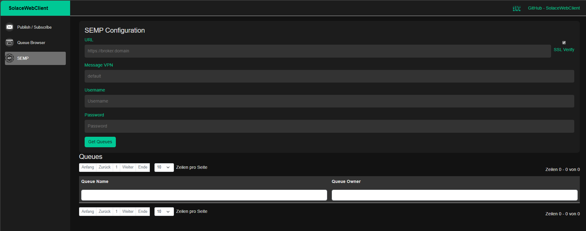

# SolaceWebClient


## Overview
The Solace Web Client is a .NET (C#) application that offers comprehensive functionalities for Queue Browsing, Publishing, and Subscribing using the Solace PubSub+ platform.

## Features
- **Queue Browsing**: View and manage messages in your Solace queues.
- **Publish & Subscribe**: Easily publish messages to topics and subscribe to them.
- **Presets Management**: Load connection presets for quick access.
- **Secure Connections (TLS)**: Supports secure connections with certificate validation.
- **User-Friendly Interface**: Intuitive and easy-to-use web interface.

## Screenshots

*Publish & Subscribe Interface*


*Queue Browser Interface*


*SEMP Interface*


## Presets
The Solace Web Client allows you to manage connection presets, making it easy to switch between different configurations.
You can either create presets directly (i.e. Exampele 5) or group them (i.e. "test" & "prod").

Create a presets.json and mount it in `/app/presets/presets.json`.

Example:
```json
[
  {
    "GroupName": "test",
    "Presets": [
      {
        "Name": "Example 1",
        "Host": "broker.domain:5555",
        "VpnName": "default",
        "Username": "demo",
        "QueueName": "demo",
        "SempUrl": "http://broker.domain:8080",
        "sempUsername": "admin"
      },
      {
        "Name": "Example 2",
        "Host": "tcps://broker.domain:55443",
        "VpnName": "default",
        "Username": "demo",
        "Topic": "a/b/c",
        "QueueName": "myqueue",
        "SempUrl": "https://broker.domain:1943",
        "sempUsername": "admin"
      }
    ]
  },
  {
    "GroupName": "prod",
    "Presets": [
      {
        "Name": "Example 3",
        "Host": "prod.domain:5555",
        "VpnName": "default",
        "Username": "demo",
        "QueueName": "demo",
        "SempUrl": "http://prod.domain:8080",
        "sempUsername": "admin"
      },
      {
        "Name": "Example 4",
        "Host": "tcps://prod.domain:55443",
        "VpnName": "default",
        "Username": "demo",
        "Topic": "a/b/c",
        "QueueName": "myqueue",
        "SempUrl": "https://prod.domain:1943",
        "sempUsername": "admin"
      }
    ]
  },
  {
    "Name": "Example 5",
    "Host": "tcps://broker.domain:55443",
    "VpnName": "default",
    "Username": "demo",
    "Topic": "a/b/c",
    "QueueName": "myqueue",
    "SempUrl": "https://broker.domain:1943",
    "sempUsername": "admin"
  }
]

```

All field are optional!

## Docker
To run the Solace Web Client using Docker, you can use the following commands:

#### Basic Run
```sh
docker run -d -p 8088:8080 gyrogearl00se/solacewebclient:latest
```

#### Optional mounts
```sh
- To validate secure connections (tcps://), mount the certificate(s) from your desired endpoint(s) in the /app/trustedca directory.
- To use presets,mount your presets.json into /app/presets/preset.json

docker run -d -p 8088:8080 -v $(pwd)/certs:/app/trustedca -v $(pwd)/presets.json:/app/presets/presets.json gyrogearl00se/solacewebclient:latest
```

Note: It is possible to disable SSL verification by unchecking "SSL Verify", though this is not recommended for production environments.

### Build
If you want to build the container image from this project:
```
docker build -t gyrogearl00se/solacewebclient:<tag> --file Dockerfile .
```

## Contributing
Contributions are welcome! Please feel free to submit a Pull Request or open an Issue to discuss any changes.


Happy messaging!
